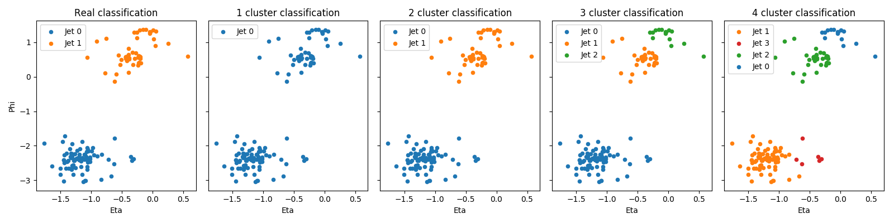
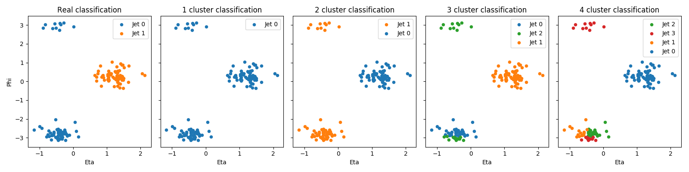
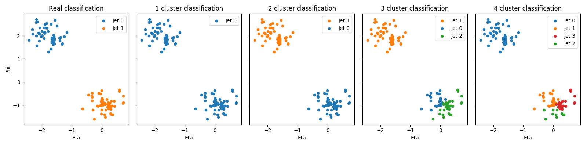
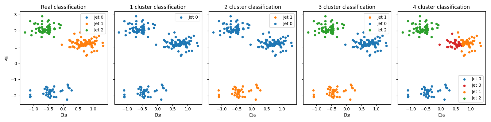
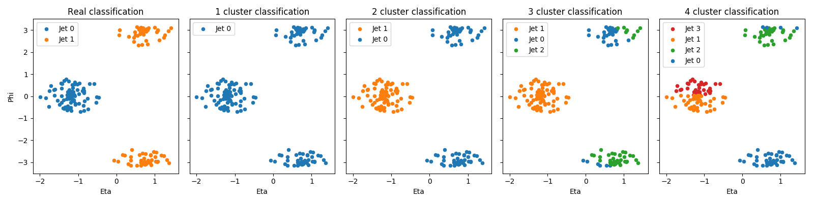
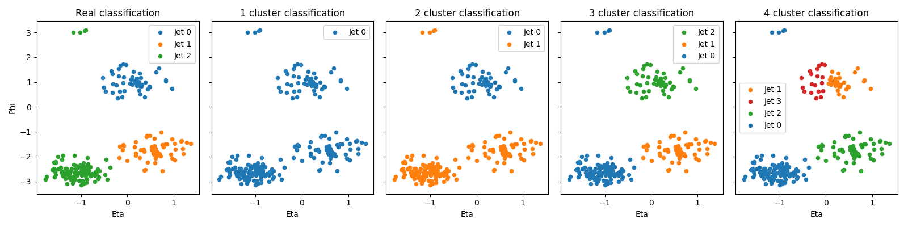
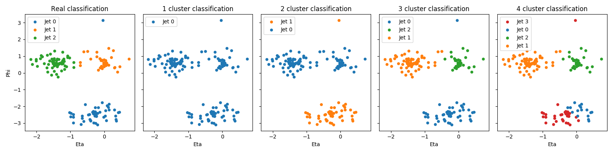
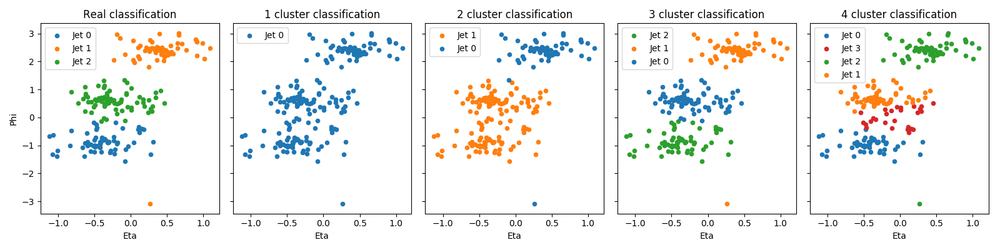
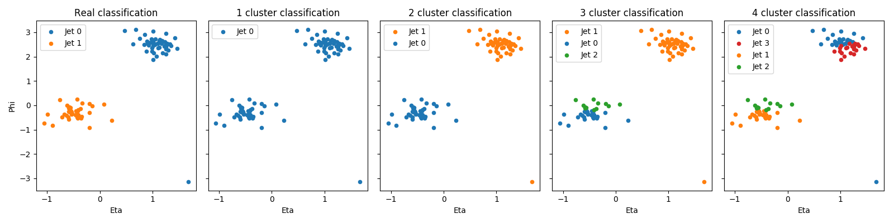
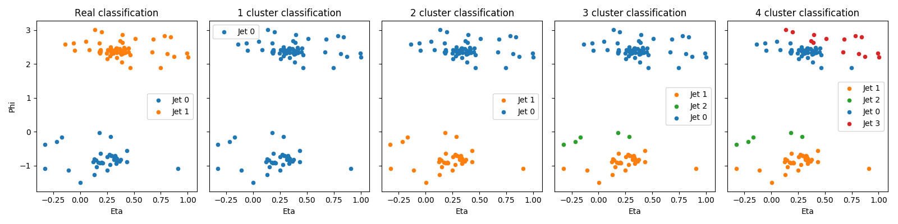

# Jet clustering with [scikit-learn](http://scikit-learn.org)

Instructions to setup the working area in **lxplus** in order to generate the csvFiles:

~~~~~~~~~~~~~~~~~~~~~~~~~~~~~~~~~~~~~~~~~~~~~~~~~~~~~~~~~~~~~~~~~~~~~~~~~~~~~~~~
cmsrel CMSSW_8_0_26_patch1
cd CMSSW_8_0_26_patch1/src
cmsenv
mkdir csvFiles; python jetConstituents.py
~~~~~~~~~~~~~~~~~~~~~~~~~~~~~~~~~~~~~~~~~~~~~~~~~~~~~~~~~~~~~~~~~~~~~~~~~~~~~~~~

The code picks the first 10 events from the dataset BulkGravToZZToZhadZhad. For each event, it creates a csv file with the list of jet constituents. 

## Exploring csv files

Each csv file contains the list of jet constituents with kinematic information necessary to seed the clusterization algorithm later on. The name of the csv file follows the syntax **run_lumi_event.csv**, for instance: 

-   [1_1_1.csv](csvFiles/1_1_1.csv)

The momentum coordinates are normalized such that

-   Px * Px + Py * Py + Pz * Pz = 1.

## Analysis of csv files

Each csv file is analysed with the code

-   [analyze_csvFiles.py](analyze_csvFiles.py)

The requirements to execute the code are

-   Pandas Data Analysis Library (http://pandas.pydata.org)
-   Machine Learning in Python (http://scikit-learn.org)
-   Python 3.X (https://www.python.org/downloads/)

The plots below show the real classification and the predictions obtained with scikit-learn for the first ten events in the dataset:

-   [1_1_1.csv](csvFiles/1_1_1.csv)

-   [1_1_2.csv](csvFiles/1_1_2.csv)

-   [1_1_3.csv](csvFiles/1_1_3.csv)

-   [1_1_5.csv](csvFiles/1_1_5.csv)

-   [1_1_6.csv](csvFiles/1_1_6.csv)

-   [1_1_7.csv](csvFiles/1_1_7.csv)

-   [1_1_9.csv](csvFiles/1_1_9.csv)

-   [1_1_11.csv](csvFiles/1_1_11.csv)

-   [1_1_13.csv](csvFiles/1_1_13.csv)

-   [1_1_15.csv](csvFiles/1_1_15.csv)

